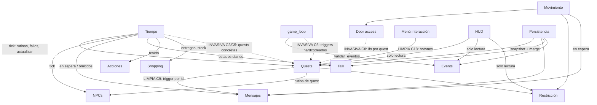

# Arquitectura de sistemas — relevamiento de conexiones

Fecha: 2026-07-31. Estado del código: post-refactor del menú de interacción (botones por quest).

**Objetivo:** el proyecto nació con la idea de sistemas independientes, pero al crecer
aparecieron acciones de un sistema que afectan a otros. Este documento inventaría todos los
sistemas, marca cada punto de conexión, y para cada uno evalúa si existe una alternativa
más limpia y menos invasiva.

**Protocolo:** este documento solo ANALIZA. Ningún cambio se implementa sin decidirlo
aparte, evaluando el daño colateral de cada fix (ver §6 para la priorización sugerida).

> **ACTUALIZACIÓN 2026-07-31:** la tanda de refactors se APLICÓ. C2, C3, C5, C6, C7,
> C8 y C11 están resueltas (C13 ya lo estaba). El detalle de cada cambio, su riesgo
> evaluado y cómo verificarlo está en `optimizacion.md`. Las secciones de abajo
> describen el estado ANTERIOR (sirven como registro del porqué de cada cambio).

---

## 1. Inventario de sistemas

| # | Sistema | Archivos principales | Estado que guarda |
|---|---------|----------------------|-------------------|
| 1 | **Tiempo** | `core/time/timesystem_core.rpy`, `despertar_system.rpy` | `horario_actual`, `dia_actual`, `dias_totales`, `dia_semana_actual` (vars `default`) |
| 2 | **Locaciones** | `core/locations/locationsystem_core.rpy`, `locations_house.rpy`, `movesystem_validation.rpy` | `sistema_locaciones` (locación actual, hotspots) |
| 3 | **Viaje rápido** | `core/locations/viaje_rapido.rpy` | ninguno (usa hotspot sintético) |
| 4 | **Door access** | `core/locations/door_access_system.rpy`, `door_relation_system.rpy` | ninguno (decide con stats en el momento) |
| 5 | **NPCs** | `core/npcs/npcsystem_core.rpy` | `sistema_npcs` (stats amor/deseo, locación, rutinas) |
| 6 | **Interacción / movimiento** | `core/npcs/npcsystem_interactions.rpy` (+ `interactions_<npc>.rpy` por personaje) | vars temporales `_hotspot_temp`, `_locacion_temp` |
| 7 | **Quests** | `core/quests/questsystem_core.rpy`, `questsystem_memories.rpy` | `sistema_quests`, `sistema_quests_mc` (etapas, días, flags) |
| 8 | **Restricción de quest** | `core/quests/restriccion_quest_system.rpy` | `restriccion_quest_activa` |
| 9 | **Events** | `core/events/eventsystem_core.rpy`, `generics.rpy` | `sistema_events` (estados oculto/visible/activo/completado) |
| 10 | **Talk** | `core/talk/talksystem_core.rpy`, `_labels.rpy`, `_screens.rpy` | `sistema_talk` (estado diario por NPC) |
| 11 | **Mensajes** | `core/messages/messagesystem_core.rpy` | `sistema_mensajes` (chats, grupos, galería, en espera) |
| 12 | **Shopping** | `core/shopping/shopping_system.rpy`, `items_shopping.rpy`, `usar_*.rpy` | `sistema_compras` (órdenes), `inventario`, `dinero`, `stock_tienda`, `repartidor_presente`, `paquete_en_habitacion` |
| 13 | **Acciones de locación** | `core/actions/actionsystem_core.rpy`, `actions_catalog.rpy` | `sistema_acciones` es `define` a propósito (estado diario se pierde al cargar, aceptado) |
| 14 | **Skins** | `core/skins/skinsystem_core.rpy` | `sistema_skins` |
| 15 | **Pensamientos** | `core/thoughts/pensamiento_system.rpy` | registro de pensamientos disponibles |
| 16 | **Relaciones/desbloqueos** | `core/relationships/relationship_unlocks.rpy` | ninguno (tabla informativa) |
| 17 | **Espiar** | `core/espiar/espiar_system.rpy` | flags propios |
| 18 | **HUD/UI** | `ui/hud/*` (navigation, pistas, tracker, celular, notificaciones), `ui/menus/*` | solo presentación |
| 19 | **Game loop** | `characters/mc/quests/intro_main.rpy` (label `game_loop`) | `_gl_ultimo_trigger` (instrumentación) |
| 20 | **Persistencia** | `core/utils/persistencia_sistemas.rpy` | stash `init 999` + merge en `after_load` |
| 21 | **Infraestructura** | `sistema_sentry.rpy`, `builtins_pisados.rpy`, `diagnostico_guardado.rpy` | — |

---

## 2. Cómo leer las conexiones

Cada conexión tiene un veredicto:

- **LIMPIA** — lectura de datos o API pública; así deben conectarse los sistemas.
- **ACEPTABLE** — hay acoplamiento, pero es orquestación necesaria o el costo de limpiarla supera el beneficio.
- **INVASIVA** — un sistema conoce contenido o internals de otro; candidata a refactor.

Y para las invasivas: la alternativa propuesta y el daño colateral de aplicarla.

---

## 3. Conexiones punto por punto

### C1. Tiempo → Compras — ACEPTABLE
`avanzar_horario()` (timesystem_core:75-81): si era mañana y el repartidor estaba, llama
`sistema_compras.colocar_paquete_en_habitacion()`. `dormir()` (246-249): `verificar_entregas_hoy()`
y prende `repartidor_presente`. Lunes: `reponer_stock()`.
**Por qué está bien:** el tiempo es el "reloj" del juego; que dispare los procesos diarios de
compras es orquestación, no invasión — no conoce items ni quests concretas.
**Mejora posible:** entraría en el patrón de hooks de §5.3 si se adopta.

### C2. Tiempo → quest concreta (Jasmine 0_b) — INVASIVA
`avanzar_horario()` (timesystem_core:66-70): si la quest `jasmine_questprincipal_0_b` está
activa, el horario NO avanza. El motor de tiempo conoce una quest por nombre.
**Alternativa más limpia:** el mecanismo ya existe — la restricción de quest bloquea acciones
(`accion_bloqueada("avanzar_tiempo")` ya se consulta en `accion_avanzar_tiempo`). La quest 0_b
debería activar una restricción con `avanzar_tiempo` bloqueado, y el `if` del motor desaparece.
**Daño colateral:** hoy el bloqueo es SILENCIOSO (el botón no hace nada); con restricción
aparecería un mensaje de bloqueo (mejor UX, pero es un cambio de comportamiento visible).
Además `avanzar_horario()` se llama desde más lugares que el botón (dormir anticipado por
mensaje prioritario, `avanzar_horario_multiple`) — verificar que la 0_b no dependa de que
TAMBIÉN esos caminos queden congelados. Riesgo: bajo. Probar la quest 0_b entera.

### C3. Tiempo → hook de quest 1 de Violet — INVASIVA (leve)
`avanzar_horario()` (timesystem_core:78-80): `if hasattr(store, 'manejar_quest1_violet_no_recibido')`.
El nombre de una función de quest vive en el motor, aunque protegido con hasattr.
**Alternativa:** un registro genérico "al irse el repartidor" (`REPARTIDOR_AL_IRSE = []`,
lista de funciones de módulo registradas por el contenido). El motor itera la lista sin
conocer nombres.
**Daño colateral:** casi nulo — hay un solo suscriptor hoy. Es el caso más barato para
estrenar el patrón registro.

### C4. Tiempo → NPCs, Quests, Mensajes, Talk, Acciones (el "tick") — ACEPTABLE
`avanzar_horario()` y `dormir()` llaman en orden: rutinas de NPCs → fallos de quests →
`actualizar_quests()` → `verificar_mensajes_en_espera()`; y al dormir además: resets diarios,
rutinas especiales del día, mensajes de horarios omitidos, entregas, resets de acciones,
estados de talk.
**Por qué está bien (por ahora):** es EL orquestador del juego; el orden importa y hoy está
explícito en un solo archivo. El problema es que el mismo grupo de llamadas se repite con
variantes en 3 lugares (avanzar, dormir, y `verificar_mensajes_en_espera` también en el
movimiento) — ver §5.3.

### C5. `accion_dormir` → contenido concreto — INVASIVA (el punto más caliente)
timesystem_core:387-448: el label de dormir tiene hardcodeados: evento 2 de Violet (antes de
`dormir()`), quest 08_a al despertar, gestión diaria de la enfermedad 09_a, mensaje del
evento 03, hook final de la quest 0 del MC, y el flag `violet_quest1_entrega_pendiente` como
bloqueo de dormir.
**Alternativa más limpia:** registro `TRIGGERS_DORMIR` en un catálogo de contenido (como
`actions_catalog.rpy`): cada entrada = `(id, fase, prioridad, condicion_fn_modulo, label)`,
con `fase` en {"antes_dormir", "despues_autosave"} porque el orden actual es semántico
(evento2 corre ANTES de avanzar el día; 08_a/09_a corren DESPUÉS del autosave). El label
`accion_dormir` solo recorre el registro.
**Daño colateral:** medio. El orden relativo actual entre 08_a y 09_a debe preservarse
(prioridad numérica). Los `jump` salen del label (no vuelven), así que solo puede saltar el
primero que matchee — el registro debe respetar esa semántica de "primer trigger gana".
Migrar UNA quest por vez y probar su ruta completa antes de la siguiente.
**Anti-pickle:** las condiciones del registro deben ser funciones de módulo (regla ya
establecida) — el registro se construye en `init`, nunca en labels.

### C6. `game_loop` → quests concretas — INVASIVA
intro_main.rpy (label `game_loop`): triggers hardcodeados de `violet_09a_piensa`,
`jasmine_0b`, `mc_q0_exploracion`, `mc_q0b`.
**Alternativa:** registro `TRIGGERS_GAME_LOOP` con el mismo patrón que C5. Bonus: el tag
`gl_trigger` de Sentry se alimentaría del id del registro automáticamente (hoy se setea a
mano antes de cada jump).
**Daño colateral:** `game_loop` es la pieza más sensible del juego (bug S11 sigue abierto e
instrumentado). Si se migra, hacerlo con la instrumentación puesta y en una versión aparte,
no mezclado con otros cambios. Riesgo: medio.

### C7. Movimiento (`accion_hotspot_move`) → Door access / baños / restricción / mensajes — ACEPTABLE
npcsystem_interactions.rpy:12-74: cadena de prioridades explícita (restricción → puerta →
baño ocupado → mover → mensajes en espera → label de locación de la restricción).
**Por qué está bien:** es el embudo único de movimiento; toda la lógica de "qué pasa al
entrar a un lugar" converge acá (por eso el viaje rápido pudo heredarlo todo con un hotspot
sintético). Ese diseño ES el patrón limpio.
**Mejora puntual (riesgo casi nulo):** la lista `["casa_hmonica", "casa_hviolet", "casa_hjasmine"]`
(línea 15) duplica las claves de `HABITACION_NPC` (door_access_system:4) — leerla de ahí
elimina el riesgo de que se desincronicen al agregar un NPC.

### C8. Door access → 12+ quests de Violet — INVASIVA (mismo antipatrón ya resuelto en el menú NPC)
door_access_system.rpy:74-143: `interaccion_puerta_npc` construye las opciones de puerta con
un `if` por quest concreta (0_b, 02_a, 02_b, 03_a, 04_b, 05_a/b/c, 06_a/b, 07_a/b, evento 03…).
Cada quest nueva de Violet obliga a editar el archivo del motor de puertas.
**Alternativa más limpia:** exactamente el refactor que ya se hizo en el menú de interacción
(2026-07-31): un registro de opciones de puerta por NPC — `registrar_opcion_puerta(npc_id,
texto, label, condicion_fn, ocultar_golpear)` — poblado desde los archivos del personaje en
`init`; el door access solo itera. El patrón ya está probado y las traducciones ya están
centralizadas en `tl/english/botones_interaccion_strings.rpy` (ese archivo ya documenta que
sirve a ambas pantallas).
**Daño colateral:** bajo-medio. Hay que preservar (a) el ORDEN de las opciones (hoy es el
orden de los ifs), (b) el flag `ocultar_golpear` por opción, (c) los casos con condición
compuesta (inventario + stat, grupo de chat completado). Con condiciones = funciones de
módulo por quest, todo eso se traslada 1 a 1. Probar la cadena de puertas de Violet entera
(0_b → 07_b) tras migrar.

### C9. Quests → Mensajes (`disparar_por_trigger`) — LIMPIA
questsystem_core:519-520, 1085-1086, 1183-1184: al cambiar de etapa / completar / fallar, la
quest dispara un trigger por ID (`"quest_etapa"`, `"quest"`, `"quest_fallo"`) y el sistema de
mensajes decide si hay un grupo registrado para ese ID. Acoplamiento débil por identificador:
así deben hablarse los sistemas.
**Riesgo residual:** los IDs son strings mágicos sin validación — un typo falla en silencio.
**Mejora:** la ruta de test `mensajes` (ver `testing_sistemas.md`) verifica que los grupos
registrados estén bien formados; se puede sumar el chequeo inverso (trigger declarado por
una quest → grupo existente) cuando las quests declaren sus triggers en un campo inspeccionable.

### C10. Quests → NPCs (rutina de quest pisa rutina normal) — ACEPTABLE
La `rutina_quest` mueve al NPC a donde la quest lo necesita, con vigencia validada por
locación (fix E07: `_rutina_quest_vigente` compara `npc.locacion_actual` con la locación de
la rutina). Es una invasión CONTROLADA y necesaria — la quest necesita al NPC en escena.
El punto delicado (dos quests con rutinas simultáneas sobre el mismo NPC) ya está cubierto
por `_buscar_rutina_quest_vigente` que revisa también `rutinas_adicionales` de otras quests.

### C11. Los TRES mecanismos de bloqueo paralelos — INVASIVA (fragmentación)
Hoy conviven:
1. **Restricción de quest** — `accion_bloqueada()` / `accion_bloqueada_movimiento()` (el mecanismo genérico bueno).
2. **Bloqueos de events** — `sistema_events.hay_bloqueo("avanzar_tiempo")`, consultado SOLO en `accion_avanzar_tiempo` (npcsystem_interactions:108).
3. **Ifs sueltos** — mensaje prioritario pendiente (chequeado a mano en `accion_dormir` Y en `accion_avanzar_tiempo`), flag `violet_quest1_entrega_pendiente` en `accion_dormir`, y el caso C2.
**Problema:** para saber "¿por qué no puedo dormir?" hay que leer 4 fuentes; y agregar un
bloqueo nuevo exige recordar en qué labels replicarlo.
**Alternativa más limpia:** que `accion_bloqueada(accion_id)` sea el ÚNICO embudo: que
internamente consulte restricción + bloqueos de events + mensajes prioritarios (cada fuente
aporta su propio mensaje). Los labels quedan con un solo `if`.
**Daño colateral:** medio-bajo. Los textos de bloqueo actuales deben conservarse por fuente.
El chequeo de mensaje prioritario tiene un caso especial en `accion_dormir` (despertar
anticipado) que NO es un bloqueo sino un flujo alternativo — ese debe quedar en el label.

### C12. Mensajes → Tiempo/Locaciones — ACEPTABLE
`verificar_mensajes_en_espera()` se llama en 3 sitios (avanzar horario, dormir, moverse):
los mensajes con condición de entrega necesitan re-evaluarse cuando el mundo cambia. Es el
mismo síntoma del tick disperso (§5.3): con hooks, el sistema de mensajes se suscribiría a
"cambió el mundo" una sola vez.

### C13. Shopping → inventario/dinero globales — ACEPTABLE (con una excepción)
`inventario` y `dinero` son dicts/vars globales compartidas; quests y door access los
consultan por string (`"mangas_violet" in inventario`). Datos globales simples, aceptable.
**Excepción a corregir algún día:** `CATALOGO_ITEMS` (un `define`) se MUTA en runtime
(violet_quest_05_c cambia el stock de `entrada_japicon`) — por eso el catálogo entero entra
al pickle del save. El stock mutable ya tiene su casa correcta: `stock_tienda` (que es
`default`). Mover esa mutación saca el catálogo del save.
**Daño colateral:** los saves existentes ya tienen el catálogo pickleado; el cambio debe
tolerar cargar esos saves (el merge de persistencia ya cubre ese caso).

### C14. Talk → NPCs — LIMPIA
Lee NPC por API (`obtener_npc`) y aplica `modificar_stat`. Las condiciones de estados son
funciones de módulo (regla anti-pickle). Sin observaciones.

### C15. HUD → Quests/Events/NPCs/Restricción — LIMPIA
`hud_pistas` lee quests activas + events visibles; `hud_tracker` lee la restricción;
notificaciones leen NPCs. Todo solo-lectura para presentación: es el uso correcto.
`hud_navigation` además dispara acciones (`pensar_mensaje`, botones) — orquestación de UI,
aceptable.

### C16. Persistencia → todos los sistemas con estado — LIMPIA (por diseño)
`persistencia_sistemas.rpy` conoce a todos los sistemas `default` porque SU TRABAJO es
snapshotearlos (`init 999`) y mergear contenido nuevo en `after_load`. Centralizado a
propósito: agregar un sistema con estado = agregarlo ahí (ya documentado en memoria).

### C17. Espiar / Viaje rápido → motor — LIMPIA
Espiar se cuelga del registro de acciones; viaje rápido fabrica un hotspot sintético y
reusa `accion_hotspot_move` completo. Ambos son ejemplos del patrón correcto: extender
enchufándose al embudo existente, sin duplicar lógica.

### C18. Interacción por NPC (menú) → Quests — LIMPIA (post-refactor 2026-07-31)
`interactions_<npc>.rpy` arma botones declarativos con condición explícita por quest; el
screen (`menu_interaction.rpy`) ordena quest → evento → Hablar. El auto-disparo que
secuestraba el click se eliminó. Este es el patrón de referencia para C8.

---

## 4. Diagrama de dependencias (resumen)

(Punteado = conexión invasiva; sólido = aceptable/limpia.)

---

## 5. Los tres patrones-problema transversales

### 5.1 Contenido concreto dentro del motor (C2, C3, C5, C6, C8)
El motor (tiempo, game_loop, puertas) conoce quests por nombre. Cada quest nueva toca
archivos del core.
**El antídoto ya está probado 3 veces en este proyecto:** registro declarativo poblado en
`init` + motor que solo itera — `actions_catalog.rpy` (listeners de acciones),
`registrar_label_locacion` (triggers de locación de la restricción), y los botones del menú
de interacción. La propuesta es repetir ese mismo patrón para: opciones de puerta (C8),
triggers de dormir (C5) y triggers de game_loop (C6).

### 5.2 Mecanismos de bloqueo fragmentados (C11)
Tres fuentes de "no podés hacer eso" consultadas de forma inconsistente según el label.
**Antídoto:** un solo embudo `accion_bloqueada()` que agregue las tres fuentes.

### 5.3 El tick disperso (C4, C12)
El grupo "rutinas + quests + mensajes" se repite con variantes en avanzar_horario, dormir y
el movimiento. Funciona, pero el orden vive en 3 copias.
**Antídoto (el de menor prioridad):** hooks `AL_AVANZAR_HORARIO` / `AL_DORMIR` /
`AL_MOVERSE` con prioridad numérica, suscritos por cada sistema en su `init`. Solo vale la
pena si C5/C6 ya se migraron; hacerlo antes es riesgo sin dolor real que lo justifique.

---

## 6. Priorización sugerida (si se decide refactorizar)

| Orden | Refactor | Valor | Riesgo | Nota |
|-------|----------|-------|--------|------|
| 1 | C8: registro de opciones de puerta | Alto (cada quest nueva de Violet deja de tocar el motor) | Bajo-medio | Patrón idéntico al del menú, ya probado |
| 2 | C3: registro "al irse el repartidor" | Bajo | Casi nulo | Barato; estrena el patrón en el motor de tiempo |
| 3 | C2: quest Jasmine 0_b vía restricción | Medio | Bajo | Elimina el if del motor; probar la quest entera |
| 4 | C5: registro TRIGGERS_DORMIR | Alto | Medio | Migrar quest por quest, con fase antes/después |
| 5 | C6: registro TRIGGERS_GAME_LOOP | Alto | Medio | Solo con S11 vigilado; versión aparte |
| 6 | C11: embudo único de bloqueos | Medio | Medio-bajo | Conservar textos por fuente |
| 7 | C13: stock fuera de CATALOGO_ITEMS | Medio (saca el catálogo del save) | Medio | Tolerar saves viejos |
| 8 | §5.3: hooks del tick | Bajo (hoy) | Medio | Último; solo tras 4 y 5 |

**Regla de oro para cualquiera de estos:** un refactor por versión, con su ruta de test
(ver `testing_sistemas.md`) corrida antes y después, y jugando la quest afectada completa.
